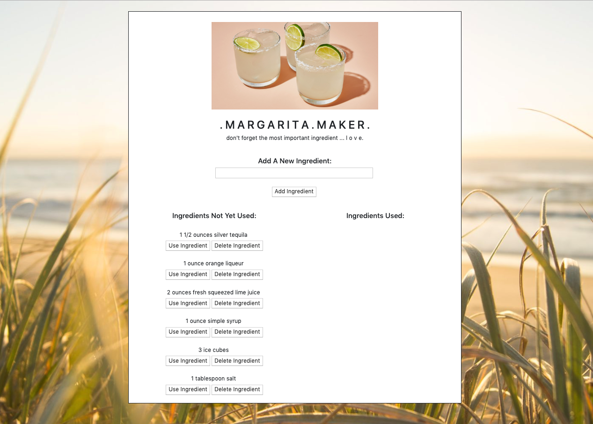
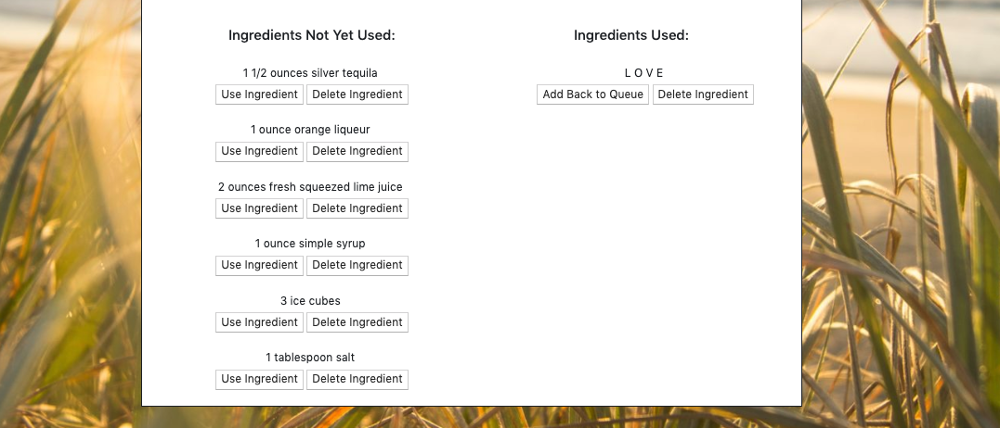

# m a r g a r i t a . m a k e r

This is my submission for assignment twelve: Node Express Handlebars. We were tasked with creating a "logger" in which a user is able to input data, in this case, an ingredient, and that information is both displayed on the DOM and is stored inside of our mysql database. The user is able to manipulate this content by adding, deleting, or updating ingredients; all of which are then updated within our database. For this assignment, we had to use our recent understanding of handlebars.js, express.js, MVC architecture, ORMs, & REST API in order to successfully accomplish our project goals.

# i n s p i r a t i o n

I created this project with the hope of simplifying the process of making cocktails! On countless occasions, I've used the internet to find drink recipes, but always find myself constantly opening my phone to check and double-check if I had already used an ingredient or forgotten it all together. Not only will I now be able to write my ingredients down, but I can also track when I've used them. 

# t e c h . i . u s e d:

[Node.js](https://www.w3schools.com/nodejs/)

[HTML](https://www.w3schools.com/html/)

[Bootstrap](https://getbootstrap.com/docs/4.3/getting-started/introduction/)

[SQL](https://www.w3schools.com/sql/)

[MySQL Workbench](https://www.mysql.com/products/workbench/)

[handlebars.js npm](https://www.npmjs.com/package/handlebars)

[CSS](https://www.w3schools.com/css/)

[JavaScript](https://www.w3schools.com/js/)

[jQuery](https://www.w3schools.com/jquery/)

[express npm](https://www.npmjs.com/package/express)

[MVC Architecture](https://www.w3schools.in/mvc-architecture/)

[ORM](https://en.wikipedia.org/wiki/Object-relational_mapping)

[REST API](https://restfulapi.net/)

Author: [Matthew Hagarty](https://github.com/matthewryanhagarty)